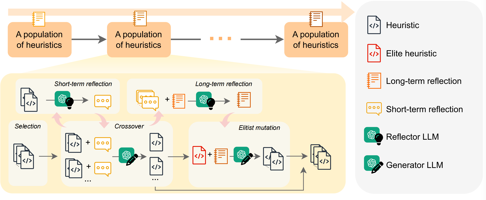

# [NeurIPS 2024] ReEvo: Large Language Models as Hyper-Heuristics with Reflective Evolution

<p align="center">
    
</p>


🥳 **Welcome!** This is a codebase that accompanies the paper [*ReEvo: Large Language Models as Hyper-Heuristics with Reflective Evolution*](https://arxiv.org/abs/2402.01145).

**Give ReEvo 5 minutes, and get a state-of-the-art algorithm in return!**

## Table of Contents

* 1\. [ News 📰](#News)
* 2\. [ Introduction 🚀](#Introduction)
* 3\. [ Exciting Highlights 🌟](#ExcitingHighlights)
* 4\. [ Usage 🔑](#Usage)
  * 4.1. [Dependency](#Dependency)
  * 4.2. [To run ReEvo](#TorunReEvo)
  * 4.3. [Available problems](#Availableproblems)
  * 4.4. [Simple steps to apply ReEvo to your problem](#SimplestepstoapplyReEvotoyourproblem)
  * 4.5. [Use Alternative LLMs](#UseAlternativeLLMs)
* 5\. [ Citation 🤩](#Citation)
* 6\. [ Acknowledgments 🫡](#Acknowledgments)


##  1. <a name='News'></a> News 📰

- **Sep. 2024:** *ReEvo: Large Language Models as Hyper-Heuristics with Reflective Evolution* has been accepted at NeurIPS 2024 🥳
- **May 2024:** We release a new paper version
- **Apr. 2024:** Novel use cases for Neural Combinatorial Optimization (NCO) and Electronic Design Automation (EDA)
- **Feb. 2024:** We are excited to release *ReEvo: Large Language Models as Hyper-Heuristics with Reflective Evolution* 🚀


##  2. <a name='Introduction'></a> Introduction 🚀



We introduce **Language Hyper-Heuristics (LHHs)**, an emerging variant of Hyper-Heuristics (HHs) that leverages LLMs for heuristic generation, featuring **minimal manual intervention and open-ended heuristic spaces**.

To empower LHHs, we present **Reflective Evolution (ReEvo)**, a generic searching framework that emulates the reflective design approach of human experts while much surpassing human capabilities with its scalable LLM inference, Internet-scale domain knowledge, and powerful evolutionary search.


##  3. <a name='ExcitingHighlights'></a> Exciting Highlights 🌟

We can improve the following types of algorithms:
- Neural Combinatorial Optimization (NCO)
- Genetic Algorithm (GA)
- Ant Colony Optimization (ACO)
- Guided Local Search (GLS)
- Constructive Heuristics

on the following problems:
- Traveling Salesman Problem (TSP)
- Capacitated Vehicle Routing Problem (CVRP)
- Orienteering Problem (OP)
- Multiple Knapsack Problems (MKP)
- Bin Packing Problem (BPP)
- Decap Placement Problem (DPP)

with both black-box and white-box settings.

##  4. <a name='Usage'></a> Usage 🔑

- Set your LLM API key (OpenAI API, ZhiPu API, Llama API) as an environment variable or like this:
    ```bash
    $ python main.py llm_client=openai llm_client.api_key="<Your API key>" # see more options in ./cfg/llm_client
    ```
- Running logs and intermediate results are saved in `./outputs/main/` by default.
- Datasets are generated on the fly.
- Some test notebooks are provided in `./problems/*/test.ipynb`.

####  4.1. <a name='Dependency'></a>Dependency

- Python >= 3.11
- openai >= 1.0.0
- hydra-core
- scipy

You may install the dependencies above via `pip install -r requirements.txt`.

Problem-specific dependencies:

- `tsp_aco(_black_box)`: pytorch, scikit-learn
- `cvrp_aco(_black_box)` / `mkp_aco(_black_box)` / `op_aco(_black_box)` / `NCO`: pytorch
- `tsp_gls`: numba==0.58


####  4.2. <a name='TorunReEvo'></a>To run ReEvo
```bash
# e.g., for tsp_aco
python main.py \
    problem=tsp_aco \  # problem name
    init_pop_size=4 \  # initial population size
    pop_size=4 \  # population size
    max_fe=20 \  # maximum number of heuristic evaluations
    timeout=20  # allowed evaluation time for one generation
```
Check out `./cfg/` for more options.

####  4.3. <a name='Availableproblems'></a>Available problems
- Traveling Salesman Problem (TSP): `tsp_aco`, `tsp_aco_black_box`, `tsp_constructive`, `tsp_gls`, `tsp_pomo`, `tsp_lehd`
- Capacitated Vehicle Routing Problem (CVRP): `cvrp_aco`, `cvrp_aco_black_box`, `cvrp_pomo`, `cvrp_lehd`
- Bin Packing Problem (BPP): `bpp_offline_aco`, `bpp_offline_aco_black_box`, `bpp_online`
- Multiple Knapsack Problems (MKP): `mkp_aco`, `mkp_aco_black_box`
- Orienteering Problem (OP): `op_aco`, `op_aco_black_box`
- Decap Placement Problem (DPP): `dpp_ga`

####  4.4. <a name='SimplestepstoapplyReEvotoyourproblem'></a>Simple steps to apply ReEvo to your problem

- Define your problem in `./cfg/problem/`.
- Generate problem instances and implement the evaluation pipeline in `./problems/`.
- Add function_description, function_signature, and seed_function in `./prompts/`.

By default:

- The LLM-generated heuristic is written into `f"./problems/YOUR_PROBLEM/gpt.py"`, and will be imported into `./problems/YOUR_PROBLEM/eval.py` (e.g. for [TSP_ACO](https://github.com/ai4co/reevo/blob/e4e479f44b9fc4cd47af91faffc0977a58b635ab/problems/tsp_aco/eval.py#L10)), which is called by [`reevo._run_code`](https://github.com/ai4co/reevo/blob/e4e479f44b9fc4cd47af91faffc0977a58b635ab/reevo.py#L229) during ReEvo.
- In training mode, `./problems/YOUR_PROBLEM/eval.py` (e.g. for [TSP_ACO](https://github.com/ai4co/reevo/blob/e4e479f44b9fc4cd47af91faffc0977a58b635ab/problems/tsp_aco/eval.py#L58)) should print out the meta-objective value as the last line of stdout, which is parsed by [`reevo.evaluate_population`](https://github.com/ai4co/reevo/blob/e4e479f44b9fc4cd47af91faffc0977a58b635ab/reevo.py#L206) for heuristic evaluation.

#### 4.5. <a name='UseAlternativeLLMs'></a>Use Alternative LLMs

Use the cli parameter `llm_client` to designate an LLM API provider, and `llm_client.model` to determine the model to use. For example,

```bash
$ export LLAMA_API_KEY=xxxxxxxxxxxxxxxxxxxx
$ python main.py llm_client=llama_api llm_client.model=gemma2-9b
```

Supported LLM API providers and models include (note that only chat models are supported):
- [**OpenAI**](https://openai.com/api/): gpt-3.5-turbo (default), gpt-4o, gpt-4o-mini, gpt-4-turbo, etc.
- [**Zhipu AI**](https://open.bigmodel.cn/): GLM-3-Turbo, GLM-4-Air, GLM-4-0520, etc. ([full list](https://open.bigmodel.cn/dev/howuse/model))
- [**DeepSeek**](https://www.deepseek.com/): deepseek-chat
- [**Moonshot AI**](https://www.moonshot.cn/): moonshot-v1-8k/32k/128k
- [**Llama API**](https://www.llama-api.com/): llama3.1-8b/70b/405b, gemma2-9b/27b, Qwen2-72B, etc. ([full list](https://docs.llama-api.com/quickstart#available-models))
- And [more **providers**](https://docs.litellm.ai/docs/providers) supported via [**LiteLLM**](https://docs.litellm.ai/docs/).


##  5. <a name='Citation'></a> Citation 🤩

If you encounter any difficulty using our code, please do not hesitate to submit an issue or directly contact us! 

We are also on [Slack](https://join.slack.com/t/rl4co/shared_invite/zt-1ytz2c1v4-0IkQ8NQH4TRXIX8PrRmDhQ) if you have any questions or would like to discuss ReEvo with us. We are open to collaborations and would love to hear from you 🚀

If you find our work helpful (or if you are so kind as to offer us some encouragement), please consider giving us a star, and citing our paper.
```bibtex
@inproceedings{ye2024reevo,
    title={ReEvo: Large Language Models as Hyper-Heuristics with Reflective Evolution}, 
    author={Ye, Haoran and Wang, Jiarui and Cao, Zhiguang and Berto, Federico and Hua, Chuanbo and Kim, Haeyeon and Park, Jinkyoo and Song, Guojie},
    booktitle={Advances in Neural Information Processing Systems},
    year={2024},
    note={\url{https://github.com/ai4co/reevo}}
}
```

##  6. <a name='Acknowledgments'></a> Acknowledgments 🫡
We are very grateful to [Yuan Jiang](https://github.com/jiang-yuan), [Yining Ma](https://github.com/yining043), [Yifan Yang](https://scholar.google.com/citations?hl=en&user=dO8kmG4AAAAJ), and [AI4CO community](https://github.com/ai4co) for valuable discussions and feedback.

Also, our work is built upon the following projects, among others:
- [DeepACO: Neural-enhanced Ant Systems for Combinatorial Optimization](https://github.com/henry-yeh/DeepACO)
- [Eureka: Human-Level Reward Design via Coding Large Language Models](https://github.com/eureka-research/Eureka)
- [Algorithm Evolution Using Large Language Model](https://arxiv.org/abs/2311.15249)
- [Mathematical discoveries from program search with large language models](https://github.com/google-deepmind/funsearch)
- [An Example of Evolutionary Computation + Large Language Model Beating Human: Design of Efficient Guided Local Search](https://arxiv.org/abs/2401.02051)
- [Evolution of Heuristics: Towards Efficient Automatic Algorithm Design Using Large Language Model](https://openreview.net/forum?id=BwAkaxqiLB)
- [DevFormer: A Symmetric Transformer for Context-Aware Device Placement](https://arxiv.org/abs/2205.13225)
