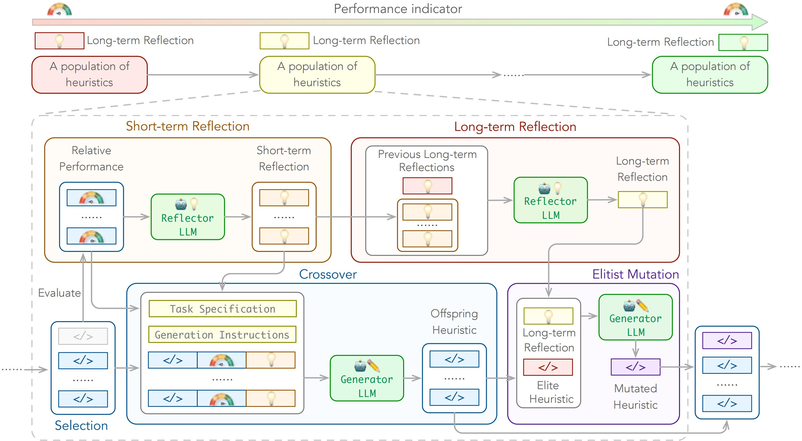

# Large Language Models as Hyper-Heuristics for Combinatorial Optimization

🥳 **Welcome!** This is a codebase that accompanies the paper [*Large Language Models as Hyper-Heuristics for Combinatorial Optimization*](https://arxiv.org/abs/2402.01145).

**Give ReEvo 5 minutes, and get a state-of-the-art algorithm in return!**

## Table of Contents

* 1. [ News 📰](#News)
* 2. [ Introduction 🚀](#Introduction)
* 3. [ Exciting Highlights 🌟](#ExcitingHighlights)
* 4. [ Usage 🔑](#Usage)
		* 4.1. [Dependency](#Dependency)
		* 4.2. [To run ReEvo](#TorunReEvo)
		* 4.3. [Available problems](#Availableproblems)
		* 4.4. [Simple steps to apply ReEvo to your problem](#SimplestepstoapplyReEvotoyourproblem)
* 5. [ Citation 🤩](#Citation)
* 6. [ Acknowledgments 🫡](#Acknowledgments)


##  1. <a name='News'></a> News 📰

- **2024.05**: We release a new paper version.
- **2024.04**: Novel use cases for Neural Combinatorial Optimization (NCO) and Electronic Design Automation (EDA).
- **2024.02**: We are excited to release ReEvo! 🚀


##  2. <a name='Introduction'></a> Introduction 🚀



We introduce **Language Hyper-Heuristics (LHHs)**, an emerging variant of Hyper-Heuristics (HHs) that leverages LLMs for heuristic generation, featuring **minimal manual intervention and open-ended heuristic spaces**.

To empower LHHs, we present **Reflective Evolution (ReEvo)**, a generic searching framework that emulates the reflective design approach of human experts while much surpassing human capabilities with its scalable LLM inference, Internet-scale domain knowledge, and powerful evolutionary search.


##  3. <a name='ExcitingHighlights'></a> Exciting Highlights 🌟

We can improve the following types of algorithms:
- Neural Combinatorial Optimization (NCO)
- Genetic Algorithm (GA)
- Ant Colony Optimization (ACO)
- Guided Local Search (GLS)
- Constructive Heuristics

on the following problems:
- Traveling Salesman Problem (TSP)
- Capacitated Vehicle Routing Problem (CVRP)
- Orienteering Problem (OP)
- Multiple Knapsack Problems (MKP)
- Bin Packing Problem (BPP)
- Decap Placement Problem (DPP)

with both black-box and white-box settings.

##  4. <a name='Usage'></a> Usage 🔑

- Set your LLM API key (OpenAI API, ZhiPu API, Llama API) [here](https://github.com/ai4co/LLM-as-HH/blob/5fa30b9da3ecb80b8a658352d26df08893f88a6c/utils/utils.py#L9-L27) or as an environment variable.
- Running logs and intermediate results are saved in `./outputs/main/` by default.
- Datasets are generated on the fly.
- Some test notebooks are provided in `./problems/*/test.ipynb`.

####  4.1. <a name='Dependency'></a>Dependency

- Python >= 3.11
- openai >= 1.0.0
- hydra-core
- scipy

You may install the dependencies above via `pip install -r requirements.txt`.

Problem-specific dependencies:

- `tsp_aco(_black_box)`: pytorch, scikit-learn
- `cvrp_aco(_black_box)` / `mkp_aco(_black_box)` / `op_aco(_black_box)` / `NCO`: pytorch
- `tsp_gls`: numba==0.58


####  4.2. <a name='TorunReEvo'></a>To run ReEvo
```bash
# e.g., for tsp_aco
python main.py problem=tsp_aco
```
Check out `./cfg/` for more options.

####  4.3. <a name='Availableproblems'></a>Available problems
- Traveling Salesman Problem (TSP): `tsp_aco`, `tsp_aco_black_box`, `tsp_constructive`, `tsp_gls`, `tsp_pomo`, `tsp_lehd`
- Capacitated Vehicle Routing Problem (CVRP): `cvrp_aco`, `cvrp_aco_black_box`, `cvrp_pomo`, `cvrp_lehd`
- Bin Packing Problem (BPP): `bpp_offline_aco`, `bpp_offline_aco_black_box`, `bpp_online`
- Multiple Knapsack Problems (MKP): `mkp_aco`, `mkp_aco_black_box`
- Orienteering Problem (OP): `op_aco`, `op_aco_black_box`
- Decap Placement Problem (DPP): `dpp_ga`

####  4.4. <a name='SimplestepstoapplyReEvotoyourproblem'></a>Simple steps to apply ReEvo to your problem

- Define your problem in `./cfg/problem/`.
- Generate problem instances and implement the evaluation pipeline in `./problems/`.
- Add function_description, function_signature, and seed_function in `./prompts/`.


##  5. <a name='Citation'></a> Citation 🤩

If you encounter any difficulty using our code, please do not hesitate to submit an issue or directly contact us! If you find our work helpful (or if you are so kind as to offer us some encouragement), please consider giving us a star, and citing our paper.

```bibtex
@article{ye2024large,
      title={Large Language Models as Hyper-Heuristics for Combinatorial Optimization}, 
      author={Haoran Ye and Jiarui Wang and Zhiguang Cao and Federico Berto and Chuanbo Hua and Haeyeon Kim and Jinkyoo Park and Guojie Song},
      year={2024},
      journal={arXiv preprint arXiv:2402.01145},
      note={\url{https://github.com/ai4co/LLM-as-HH}}
}
```

##  6. <a name='Acknowledgments'></a> Acknowledgments 🫡
We are very grateful to [Yuan Jiang](https://github.com/jiang-yuan), [Yining Ma](https://github.com/yining043), [Yifan Yang](https://scholar.google.com/citations?hl=en&user=dO8kmG4AAAAJ), and [AI4CO community](https://github.com/ai4co) for valuable discussions and feedback.

Also, our work is built upon the following projects, among others:
- [DeepACO: Neural-enhanced Ant Systems for Combinatorial Optimization](https://github.com/henry-yeh/DeepACO)
- [Eureka: Human-Level Reward Design via Coding Large Language Models](https://github.com/eureka-research/Eureka)
- [Algorithm Evolution Using Large Language Model](https://arxiv.org/abs/2311.15249)
- [Mathematical discoveries from program search with large language models](https://github.com/google-deepmind/funsearch)
- [An Example of Evolutionary Computation + Large Language Model Beating Human: Design of Efficient Guided Local Search](https://arxiv.org/abs/2401.02051)
- [DevFormer: A Symmetric Transformer for Context-Aware Device Placement](https://arxiv.org/abs/2205.13225)
